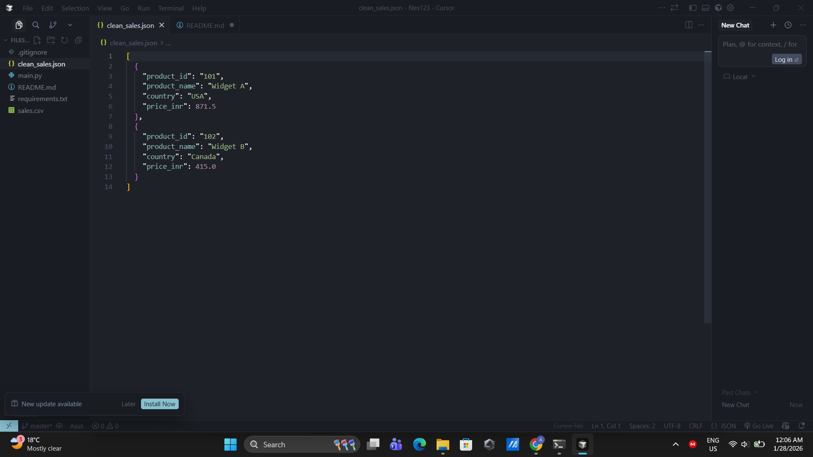

# Sales Data Cleaner

## Project Title & Goal
Cleans messy sales CSV data by removing duplicates and converting USD prices to INR, then saves it as JSON.

## Setup Instructions
```bash
python main.py
```

That's it! No external packages needed - just Python 3.6+

## The Logic (How I Thought)

### Why I chose this approach

I decided to break down the problem into small steps - read the CSV, clean the messy fields (removing $ signs and quotes), find duplicates, convert currency, and save as JSON. 

The main reason I went with the standard csv module instead of something like pandas is because the problem said no external dependencies. Also, for a small dataset like this, the csv module is more than enough and keeps things simple.

For duplicate detection, I used a set with tuples of (product_name, price). This way, when I see the same product with the same price again, I can skip it. I chose to keep the first occurrence because that felt like the natural thing to do.

I also added some print statements to show what's happening at each step - mostly because when I was testing, I wanted to see if duplicates were actually being removed or not.

### Hardest bug I faced and how I fixed it

Honestly, the trickiest part was getting the duplicate detection to work correctly. 

At first, I was checking for duplicates right after reading the CSV by comparing the raw strings. But here's what happened - row 1 had `"$10.50"` and row 3 had `10.50` (no dollar sign). After cleaning, both strings looked the same visually, but when I printed them, I realized one was `"10.50"` as a string and the other was already converted to a float somewhere in my messy first version.

The duplicates weren't being caught because I was comparing at the wrong stage. So I restructured the code to:
1. Clean ALL the fields first (remove $, quotes, whitespace)
2. Convert price to float immediately after cleaning
3. THEN check for duplicates using the float value

This way `$10.50` and `10.50` both become `10.5` (float) and are correctly identified as duplicates.

Lesson learned: always convert data types early in the pipeline so you're comparing apples to apples.

## Output Screenshots

Here's what the `clean_sales.json` file looks like when opened in a text editor:



As you can see, the output contains 2 records instead of the original 3 - the duplicate Widget A entry (row 103) was successfully removed. The prices are now in INR (871.5 and 415.0) instead of USD, converted at the rate of 1 USD = 83 INR.

## Future Improvements

If I had 2 more days to work on this, here's what I'd add:

**Better configuration**
- Right now the conversion rate (83) is hardcoded. I'd move it to a config file or command line argument so it's easy to change without editing code
- Same for input/output filenames

**More robust error handling**
- What if someone puts a completely invalid CSV? Right now it might crash
- Add better validation - like checking if country codes are valid, or if product IDs follow a certain format

**Handling different CSV formats**
- Some CSVs have headers, some don't. Mine assumes no headers
- Different files use different delimiters (commas vs semicolons vs tabs)
- Would add auto-detection for these

**Testing**
- Write some unit tests to make sure each function works correctly
- Test with edge cases like empty files, all duplicates, weird characters in product names

**Performance tracking**
- Add a simple timer to show how long the processing took
- Could be useful if someone wants to run this on a huge CSV with thousands of rows

**Better reporting**
- Generate a summary file showing: how many duplicates were found, total records processed, maybe some basic stats like average price
- Would help with debugging if something seems off